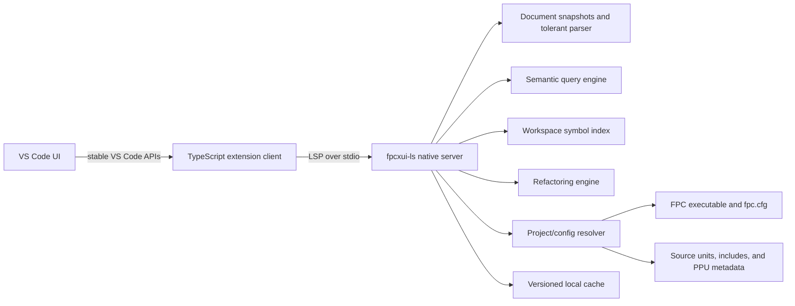

# FPC XUI: VS Code FreePascal Language Support

**Status:** Architecture and implementation plan

**Date:** 2026-07-17

**Target:** Visual Studio Code Desktop and Remote on Windows, macOS, and Linux

## 1. Objective and scope

FPC XUI is a lightweight, local-first VS Code extension for modern FreePascal development. A thin TypeScript extension client starts a native language server compiled with Free Pascal. The server owns parsing, semantic analysis, indexing, completion, diagnostics, navigation, and refactoring. It does not require Lazarus, Lazarus CodeTools, `.lpi` files, or a Lazarus installation.

The product target is Kotlin/IntelliJ-class language intelligence within the feature scope below. Performance parity is a measured release gate, not a qualitative claim.

### In scope

- FreePascal and Object Pascal source: `.pas`, `.pp`, `.inc`, and program/library entry files such as `.lpr` without depending on Lazarus metadata.
- FPC, Object Pascal, Delphi-compatible, Mac Pascal, Turbo Pascal, ISO, and Extended Pascal modes as supported and identified by FPC configuration or source directives.
- Lossless, error-tolerant, incrementally updated syntax trees and typed semantic trees.
- LSP diagnostics, completion, hover, navigation, symbols, semantic tokens, hierarchy, hints, code actions, formatting, and refactoring.
- Project understanding from FPC compiler configuration, compiler arguments, source directives, unit/include paths, defines, target OS/CPU, and `uses` graphs.
- Native VSIX packages for supported OS/architecture pairs and Remote Development hosts.
- Offline operation and opt-in, redacted telemetry only if telemetry is added later.

### Out of scope for the first general release

- A new IDE, editor, compiler, linker, form designer, or Lazarus compatibility layer.
- VS Code for the Web. The initial server is a native FPC executable and must run where the workspace files and compiler are available.
- Debug Adapter Protocol support. It can be a separate project after language-intelligence parity.
- Automatic execution of arbitrary Makefiles or scripts during workspace discovery.
- Bit-for-bit emulation of proprietary Delphi compiler behavior outside documented FPC compatibility modes.

### Fixed design decisions

1. **VS Code-only frontend.** All user-facing behavior is delivered through stable VS Code extension APIs.
2. **Native Pascal server.** Language rules live in Pascal, close to FPC types and test corpora; TypeScript remains an adapter.
3. **Standard LSP first.** Baseline against stable LSP 3.17 capabilities. Negotiate supported 3.18 capabilities individually because the current 3.18 specification is marked under development.
4. **No compiler internals linked into the server.** FPC is invoked as a separate compiler-oracle process. This avoids unstable compiler-internal APIs, global compiler state, and direct GPL coupling.
5. **Independent tolerant parser.** The interactive AST requires lossless trivia, incomplete-code recovery, stable subtree reuse, and incremental reparsing. These capabilities are not established by the published `fcl-passrc` reference, so the package remains a comparison/bootstrap input unless the M0 spike proves otherwise.
6. **Source-first indexing.** Read Pascal source when available. Use the open-source `ppudump` utility as a versioned fallback for compiled-only `.ppu` dependencies.
7. **Open-source-only toolchain.** FPC XUI source, build scripts, fixtures, and benchmark harness use an OSI-approved project license and audited open-source dependencies; no closed component is required to build, test, package, or run it.

## 2. Architecture overview



### 2.1 Components

| Component | Runtime | Responsibility |
|---|---|---|
| Extension client | VS Code Extension Host, TypeScript | Activation, platform binary selection, workspace trust, settings, commands, LSP lifecycle, status, logs, and VS Code tasks |
| LSP transport | Native server process, Pascal | JSON-RPC 2.0 `Content-Length` framing over stdio, cancellation, progress, capability negotiation, request dispatch |
| Document store | Pascal | Immutable source snapshots, piece table, UTF-8/UTF-16 position maps, incremental edits, version checks |
| Syntax engine | Pascal | Directive-aware lexer, lossless CST, tolerant parser, incremental reparse, AST projection |
| Project resolver | Pascal | FPC executable/version, compiler mode, `fpc.cfg`, explicit options, defines, include/unit paths, target OS/CPU, root units |
| Semantic engine | Pascal | Scopes, symbols, types, overload resolution, generics, helpers, visibility, references, constant evaluation, control/data flow |
| Index | Pascal | Exported symbols, reference postings, dependency graph, file fingerprints, compact persistent shards |
| Compiler oracle | Separate FPC process | Authoritative saved-file/build diagnostics and conformance comparison using the exact project options |
| Refactoring engine | Pascal | Preconditions, data-flow analysis, edit planning, conflict detection, preview, post-edit validation |
| Benchmark harness | TypeScript + Pascal | LSP traces, latency distributions, memory/CPU samples, correctness fixtures, Kotlin/IntelliJ comparison reports |

### 2.2 Process and concurrency model

- One language-server process per VS Code workspace by default; multi-root folders share a process only when compiler/toolchain fingerprints match.
- The protocol thread only frames and queues messages. It never parses or waits for FPC.
- A bounded worker pool parses and indexes closed files. Open-document work has priority.
- Each document has an immutable current snapshot. Results carry the source version; stale results are discarded before publication.
- Semantic graph commits use a single writer. Readers use immutable graph generations without global locks.
- Every request observes cancellation. Completion and hover have short budgets; expensive documentation and edits are deferred to `resolve` requests.
- Index shards are written to a temporary file and atomically renamed. Cache corruption causes a shard rebuild, not server failure.

### 2.3 Project model and configuration

Resolution order:

1. Explicit `fpcXui.projects` VS Code setting or `fpcxui.json`.
2. Workspace `fpc.cfg`, compiler options, and root program/library/unit files.
3. Source directives and recursive `uses`/include discovery.
4. Installed compiler defaults queried from the configured FPC executable.

The resolver must reproduce FPC's case-insensitive unit lookup and path precedence. FPC documentation states that command-line and configuration paths participate in a defined unit-search order, and that source modes can override command-line modes. The resolver therefore stores a **toolchain fingerprint**:

```text
FPC version + compiler path + target OS/CPU + mode + normalized options
+ ordered unit/include paths + defines + relevant config hashes
```

Any fingerprint change invalidates only affected semantic/index shards. The extension launches executables directly with an argument array; it does not pass project strings through a shell.

Example optional configuration:

```json
{
  "version": 1,
  "projects": [
    {
      "name": "app",
      "root": "src/app.lpr",
      "compiler": "fpc",
      "options": ["-Mobjfpc", "-Fu${workspaceFolder}/src"],
      "defines": ["DEBUG"]
    }
  ]
}
```

No Lazarus file is required or read by the core resolver.

### 2.4 Distribution

- Publish platform-specific VSIX packages for `win32`, `linux`, and `darwin`, initially `x64` and `arm64` where FPC can produce and CI can verify the binary.
- Bundle one stripped `fpcxui-ls` executable, language configuration, TextMate grammar, snippets, notices, and TypeScript client bundle.
- Run the extension on the remote side for SSH, containers, and WSL so the server sees remote paths and the remote FPC toolchain.
- Permit an explicit `fpcXui.server.path` for developers, but reject implicit workspace-controlled executable paths in untrusted workspaces.
- Do not bundle Lazarus libraries or invoke Lazarus programs.

### 2.5 Open-source building blocks

| Tool/library | Use | Boundary |
|---|---|---|
| Free Pascal compiler, RTL, and FCL | Build server; exact compiler oracle | Invoke compiler as a process; link only approved RTL/FCL units after license audit |
| `fpjson` / `jsonparser` | JSON-RPC encoding and decoding | Wrap with strict LSP validation and message-size limits |
| `fcl-passrc` | Grammar comparison and declaration fixtures | Development/conformance aid, not the interactive AST |
| `ppudump` | Public definitions for source-unavailable units | Versioned adapter; never parse unknown output silently |
| `vscode-languageclient` | Standard VS Code-to-LSP bridge | TypeScript client only |
| `@vscode/test-cli` and `@vscode/test-electron` | VS Code integration tests | Pin VS Code versions in CI |
| FPCUnit | Pascal unit, parser, semantic, and protocol tests | Server test suite |
| IntelliJ Community, Kotlin plugin, and `intellij-ide-starter` | Open-source comparison harness | Benchmark-only; never shipped with FPC XUI |

Milestone 0 must record exact versions, SPDX identifiers, notices, redistribution terms, and source-offer obligations. No dependency enters release packaging without this audit.

## 3. FreePascal AST design

### 3.1 Requirements

The tree must be:

- lossless: tokens, whitespace, comments, directives, casing, and inactive conditional branches remain representable;
- error tolerant: incomplete declarations and expressions still produce useful scopes and expected types;
- incremental: a local edit does not rebuild an entire unit or workspace;
- mode aware: keywords, generics, string rules, helpers, operators, and directives depend on the effective FPC mode;
- position safe: internal UTF-8 byte offsets map exactly to LSP UTF-16 positions;
- stable enough for refactoring: unchanged subtrees retain identity across snapshots.

### 3.2 Four layers

1. **Lexical layer**
   - Tokens include leading/trailing trivia and raw spelling.
   - Directives are tokens, not comments.
   - A preprocessor state records defines, includes, macros, modes, and conditional branches.
   - Inactive branches become `ConditionalRegion` nodes rather than disappearing.

2. **Lossless concrete syntax tree (CST)**
   - Immutable compact **green nodes** store kind, child references, byte width, hash, and diagnostic flags.
   - Lazy **red nodes** add parent, absolute position, snapshot, and typed navigation.
   - Recovery uses `MissingToken`, `SkippedTokens`, and `ErrorNode`; it synchronizes at semicolons, section keywords, `begin/end`, and declaration boundaries.

3. **Normalized AST**
   - Removes punctuation-only structure but retains source spans back to the CST.
   - Normalizes dialect variants into shared nodes while recording the originating syntax and mode.
   - Main families: module, section, uses item, declaration, type, member, generic parameter/constraint, routine, statement, expression, directive, and assembler block.

4. **Semantic IR**
   - Symbols, scopes, resolved references, types, overload sets, instantiated generics, implicit conversions, constant values, call graph, control-flow graph, and data-flow facts.
   - Symbol identity is independent of spelling: `UnitId + declaration path + signature key`.
   - References record the active conditional configuration that made them reachable.

### 3.3 Core node model

```pascal
type
  TSyntaxKind = (
    skCompilationUnit, skUnitDecl, skProgramDecl, skUsesClause,
    skTypeDecl, skVarDecl, skConstDecl, skRoutineDecl,
    skBlockStmt, skIfStmt, skCallExpr, skNameExpr,
    skConditionalRegion, skMissingToken, skErrorNode
  );

  TSourceSpan = record
    StartByte: UInt32;
    ByteLength: UInt32;
  end;

  TGreenNode = class
  public
    Kind: TSyntaxKind;
    FullWidth: UInt32;
    StructuralHash: QWord;
    Children: array of TGreenNode;
  end;

  TAstNode = class
  public
    Syntax: TGreenNode;
    Span: TSourceSpan;
  end;

  TRoutineDecl = class(TAstNode)
  public
    Name: UTF8String;
    Parameters: array of TAstNode;
    ReturnType: TAstNode;
    Body: TAstNode; // nil for forward/external/interface-only declarations
  end;
```

This is structural sample code; production code should use arenas/indices rather than one heap object per token.

### 3.4 Incremental update algorithm

1. Apply the LSP range edit to the piece table and update the line map.
2. Expand the lexical damage range to a safe token boundary; expand farther for strings, nested comments, directives, macros, and includes.
3. Re-lex until both token sequence and preprocessor state converge with the previous snapshot.
4. Select the smallest independently parseable ancestor containing the damage range.
5. Reparse that region with recovery; reuse green children whose kind, width, and hash match.
6. Rebuild affected AST projections, scopes, and semantic queries only.
7. Invalidate dependent queries by symbol/dependency keys, not by whole workspace.
8. Publish diagnostics or request results only if the document version still matches.

If an include file or global define changes, invalidate the dependency graph edges whose preprocessor state includes that input. If convergence cannot be proven, fall back to a full unit parse.

### 3.5 FreePascal semantic rules that require explicit modeling

- Case-insensitive identifiers with source-preserved spelling.
- Interface versus implementation visibility and ordered `uses` scopes.
- Unit aliases, namespaces, qualified names, and source paths.
- Overloads, default parameters, procedural variables, operators, and calling conventions.
- Classes, objects, records, interfaces, visibility sections, nested types, properties, helpers, and inheritance.
- FPC and Delphi generic syntax, specialization, constraints, and overload interaction.
- Nested routines and captured variables.
- `with` scopes and their ambiguity.
- Mode-dependent strings, chars, keywords, and implicit conversions.
- Conditional compilation, include files, macros, and target-specific predefined symbols.
- Inline assembler as an opaque, scoped syntax island initially; register-aware analysis is later work.

### 3.6 AST access in VS Code

Expose a custom read-only `fpc/ast` LSP request and an **FPC: Show Syntax Tree** command. The response contains node kind, source range, selected semantic annotations, and child nodes. It is for inspection and extension diagnostics; language features must use the in-process typed representation, not serialize and reparse JSON.

## 4. LSP feature set and VS Code mapping

The TypeScript client should use `vscode-languageclient`; the table identifies the underlying stable VS Code provider API for auditability.

| Priority | Capability | LSP method(s) | VS Code API |
|---|---|---|---|
| P0 | Incremental document sync | `textDocument/didOpen`, `didChange`, `didClose`, `didSave` | `workspace.onDid*TextDocument` via language client |
| P0 | Diagnostics | `textDocument/publishDiagnostics`; later pull diagnostics | `languages.createDiagnosticCollection` |
| P0 | Completion | `textDocument/completion`, `completionItem/resolve` | `languages.registerCompletionItemProvider` |
| P0 | Hover | `textDocument/hover` | `languages.registerHoverProvider` |
| P0 | Signature help | `textDocument/signatureHelp` | `languages.registerSignatureHelpProvider` |
| P0 | Declaration | `textDocument/declaration` | `languages.registerDeclarationProvider` |
| P0 | Definition | `textDocument/definition` | `languages.registerDefinitionProvider` |
| P0 | References | `textDocument/references` | `languages.registerReferenceProvider` |
| P0 | Document symbols | `textDocument/documentSymbol` | `languages.registerDocumentSymbolProvider` |
| P0 | Workspace symbols | `workspace/symbol`, `workspaceSymbol/resolve` | `languages.registerWorkspaceSymbolProvider` |
| P0 | Rename | `textDocument/prepareRename`, `textDocument/rename` | `languages.registerRenameProvider` |
| P0 | Code actions/refactors | `textDocument/codeAction`, `codeAction/resolve` | `languages.registerCodeActionsProvider` |
| P0 | Folding | `textDocument/foldingRange` | `languages.registerFoldingRangeProvider` |
| P0 | Semantic highlighting | `textDocument/semanticTokens/full`, `/delta`, `/range` | `languages.registerDocumentSemanticTokensProvider`, `registerDocumentRangeSemanticTokensProvider` |
| P1 | Type definition | `textDocument/typeDefinition` | `languages.registerTypeDefinitionProvider` |
| P1 | Implementation | `textDocument/implementation` | `languages.registerImplementationProvider` |
| P1 | Document highlights | `textDocument/documentHighlight` | `languages.registerDocumentHighlightProvider` |
| P1 | Call hierarchy | `textDocument/prepareCallHierarchy`, `callHierarchy/*` | `languages.registerCallHierarchyProvider` |
| P1 | Type hierarchy | `textDocument/prepareTypeHierarchy`, `typeHierarchy/*` | `languages.registerTypeHierarchyProvider` |
| P1 | Inlay hints | `textDocument/inlayHint`, `inlayHint/resolve` | `languages.registerInlayHintsProvider` |
| P1 | Code lens | `textDocument/codeLens`, `codeLens/resolve` | `languages.registerCodeLensProvider` |
| P1 | Selection ranges | `textDocument/selectionRange` | `languages.registerSelectionRangeProvider` |
| P1 | Formatting | `textDocument/formatting`, `rangeFormatting`, `onTypeFormatting` | `registerDocumentFormattingEditProvider`, `registerDocumentRangeFormattingEditProvider`, `registerOnTypeFormattingEditProvider` |
| P2 | Linked editing | `textDocument/linkedEditingRange` | `languages.registerLinkedEditingRangeProvider` |
| P2 | Document links | `textDocument/documentLink`, `documentLink/resolve` | `languages.registerDocumentLinkProvider` |
| P2 | Custom AST inspection | `fpc/ast` | `commands.registerCommand` plus virtual document |

### 4.1 Diagnostic tiers

- **Tier A — lexical/syntax:** update after each edit; errors, missing tokens, malformed directives, unmatched blocks.
- **Tier B — semantic:** unknown/ambiguous names, type mismatch, visibility, overload/generic failures, unreachable code, unused declarations, shadowing.
- **Tier C — compiler oracle:** exact FPC diagnostics on save, explicit validate, or build. Invoke the configured compiler with the real project arguments and an isolated output directory; never overwrite user build artifacts.

Diagnostics include stable codes, source (`fpcxui` or `fpc`), related locations, tags, and safe quick fixes. Compiler output adapters are versioned and fixture-tested; unrecognized lines remain visible in the output channel instead of being fabricated as source diagnostics.

## 5. Intelligent autocomplete

### 5.1 Pipeline

1. **Context extraction:** locate the recovered syntax node, prefix, receiver, statement/declaration position, effective mode/directives, and expected type.
2. **Candidate generation:** query narrow sources in priority order:
   - local variables, parameters, implicit routine result, and nested declarations;
   - members of the receiver and active `with` scopes;
   - enclosing type/unit and inherited members;
   - imported units and visible global declarations;
   - keywords, directives, snippets, and override/implementation templates;
   - workspace symbols eligible for an auto-import edit.
3. **Semantic filtering:** remove inaccessible, inactive, impossible, or mode-invalid candidates; retain valid overloads as a grouped item where appropriate.
4. **Ranking:** compute deterministic scores and stable tie breaks.
5. **Fast response:** return bounded labels, kinds, sort keys, signatures, and minimal edits.
6. **Resolve:** calculate documentation, expensive detail, and auto-import/uses-clause edits in `completionItem/resolve`.

### 5.2 Ranking model

All component scores are normalized to `[0,1]`:

```text
score = 0.34 * prefixMatch
      + 0.20 * scopeProximity
      + 0.16 * expectedTypeCompatibility
      + 0.10 * receiverSpecificity
      + 0.08 * sessionRecency
      + 0.07 * localUsageFrequency
      + 0.05 * importLocality
      - penalties
```

Penalties cover deprecation, an expensive auto-import, a required implicit conversion, and ambiguous `with` resolution. Inaccessible and inactive symbols are filtered, not penalized.

Ranking details:

- Prefix matching: exact case-insensitive prefix > camel/subword boundary > subsequence > bounded edit distance. Matching remains case-insensitive; inserted text uses declaration spelling.
- Scope: local > parameter > enclosing member > inherited member > same unit > imported unit > auto-import.
- Expected type: exact > alias-equivalent > assignment-compatible > convertible > unknown.
- Receiver specificity rewards members declared on the concrete type over distant ancestors/helpers.
- Session recency and usage are local-only, bounded, and never sent over a network.
- Stable tie break: case-folded label, declaration kind, signature key, then symbol ID. Identical input must not reorder the list.

### 5.3 Pascal-specific completion behavior

- After `.`: resolve class/record/interface/object members, helpers, visibility, static/class members, generic substitutions, and properties.
- In a call: rank overloads by argument count, named context, parameter modes, and conversion cost; feed the same overload set to signature help.
- In `uses`: suggest resolvable units and avoid duplicates; place an auto-import in interface or implementation according to actual reference visibility and cycle analysis.
- In an override: synthesize the correct signature, modifiers, inherited call, and implementation stub.
- In directives: suggest only directives and values valid for the current mode and location.
- Under incomplete syntax: use missing nodes and expected-token sets rather than falling back to a workspace-wide word list.

### 5.4 Completion quality metrics

- p50/p95/p99 latency and cancellation latency.
- Mean reciprocal rank, top-1, and top-5 accuracy over curated cursor fixtures.
- Zero inaccessible-symbol suggestions in correctness fixtures.
- Auto-import compile success and no new unit cycles.
- List stability under repeated identical requests.

## 6. Refactoring model and operations

### 6.1 Safety pipeline

Every refactoring follows the same transaction:

1. Resolve the selected syntax to one unambiguous symbol/expression.
2. Check language-mode, visibility, conditional-compilation, writeability, and source-version preconditions.
3. Build affected symbol/reference and control/data-flow sets.
4. Produce edits against immutable versions; preserve comments, directives, line endings, and local formatting.
5. Detect case-insensitive name collisions, overload changes, unit cycles, read-only/generated files, and overlapping edits.
6. Reparse and reanalyze the projected result in memory.
7. Return a versioned `WorkspaceEdit` with change annotations for preview.
8. After application, schedule semantic validation and optional FPC compiler validation.

If safety cannot be proven, offer a disabled code action with a specific reason. Do not return a partial edit.

### 6.2 Operations

| Stage | Refactoring | Required analysis |
|---|---|---|
| P0 | Rename symbol | Complete reference set, case-fold collision detection, overload identity, conditional branches |
| P0 | Organize `uses` | Symbol provenance, interface/implementation visibility, dependency cycles, directive preservation |
| P0 | Add missing unit / qualify name | Symbol index, ambiguity and cycle checks |
| P0 | Generate routine implementation | Interface declaration pairing, signature/modifier normalization |
| P0 | Implement interface / override members | Inheritance graph, visibility, generic substitution |
| P1 | Extract local variable/constant | Expression type, purity/evaluation order, scope and capture analysis |
| P1 | Extract procedure/function/method | Selection normalization, inputs, outputs, `var`/`out`, routine result, captures, control-flow exits |
| P1 | Inline local/constant/routine | Use count, side effects, precedence, evaluation count, recursion checks |
| P1 | Change signature | Call graph, overload resolution, default parameters, procedural types, interface/implementation pairs |
| P1 | Encapsulate field / generate property | Read/write references, visibility, getter/setter generation |
| P2 | Move declaration between units | Visibility, unit dependencies, qualification, initialization/finalization constraints |
| P2 | Safe delete | Complete reference and override/implementation graph |
| P2 | Convert compatible syntax | Mode-aware rewrite with compiler validation |

Rename must treat identifiers as case-insensitive and apply the user's requested canonical spelling to every resolved occurrence. A textual match is never enough; comments and strings change only through a separate opt-in action.

### 6.3 Extract routine algorithm

1. Expand selection to complete statements or one expression.
2. Construct a control-flow graph and reject unsupported entry/exit shapes.
3. Variables read before assignment become value/`const` inputs.
4. Variables assigned and read afterward become `var`/`out` parameters or a function result when exactly one safe result exists.
5. Captured outer variables and `Self` determine whether extraction is local, unit-level, or a method.
6. Preserve evaluation order, exception behavior, labels, `Exit`, and managed-value lifetimes.
7. Insert declaration/body in the smallest valid scope, replace the selection, format changed ranges, and re-run overload resolution.

## 7. Performance benchmark plan

### 7.1 Definition of parity

No external Kotlin number is assumed. Milestone 0 pins a specific IntelliJ IDEA Community build, Kotlin plugin build, VS Code build, FPC build, OS image, and hardware profile, then measures both products end to end.

**General-availability gate:** for every high-frequency operation, FPC XUI p95 latency must be no slower than the measured Kotlin/IntelliJ p95 on the matched workload and must meet the absolute ceiling below. A weighted average cannot hide a failing operation. Idle/steady memory and cold-index wall time must also be no worse than the Kotlin baseline after normalizing dataset size.

| Scenario | FPC XUI absolute ceiling | Comparative gate |
|---|---:|---:|
| Cold extension activation to basic syntax-ready | 750 ms p95 | `<= Kotlin baseline` |
| Warm completion, medium project | 100 ms p95 | `<= Kotlin baseline` |
| Hover / go-to-definition | 100 ms p95 | `<= Kotlin baseline` |
| Edit to syntax diagnostics | 150 ms p95 | `<= Kotlin baseline` |
| Edit to semantic diagnostics | 750 ms p95 | `<= Kotlin baseline` |
| Workspace rename, 100k LOC / 1,000 references | 2 s p95 to preview | `<= Kotlin baseline` |
| Cold index, 1M LOC | 30 s p95 | `<= Kotlin normalized LOC/s` |
| Server idle RSS after medium index | 150 MiB | `<= Kotlin language-service delta` |
| TypeScript extension-host RSS delta | 25 MiB | fixed ceiling |
| Compressed platform VSIX | 30 MiB | fixed ceiling |

Absolute ceilings are regression contracts. If the Kotlin baseline is faster, the comparative value wins.

### 7.2 Workloads

- **Small:** 10k LOC, 50 units, shallow dependency graph.
- **Medium:** 100k LOC, 500 units, generics, helpers, overloads, includes, and conditional compilation.
- **Large:** 1M LOC, 5,000 units, high fan-in/fan-out and compiled-only dependencies.
- **Real FPC corpus:** pinned open-source FPC RTL/packages and at least two independent FPC applications with redistribution approval.
- **Matched synthetic pair:** Pascal and Kotlin projects generated from the same symbol/dependency graph, declaration count, reference count, type depth, overload width, and edit scripts.

The matched pair controls structure; real projects expose language-specific behavior. Results are reported separately, not blended.

### 7.3 Measurement protocol

1. Fix CPU governor/power mode, memory, filesystem, tool versions, plugins, and background processes.
2. Disable unrelated VS Code/IntelliJ plugins and network access.
3. Record cold-cache and warm-cache runs separately.
4. Use identical scripted actions: open project, await ready marker, edit, complete, hover, navigate, find references, and rename.
5. Run at least 30 cold trials and 100 warm interactive trials per scenario after declared warmups.
6. Capture monotonic timestamps at UI command, LSP client send/receive, server queue/start/end, and result render/accept.
7. Report median, p95, p99, standard deviation, bootstrap confidence interval, peak/steady RSS, CPU time, disk reads/writes, and cache size.
8. Store raw JSON results and environment manifest as CI artifacts.

Use VS Code's supported extension test host for FPC XUI. Use the Apache-2.0 `intellij-ide-starter` framework and open-source IntelliJ Community/Kotlin builds for the Kotlin baseline. Compare end-to-end latency and engine-only latency so host-application overhead is visible.

### 7.4 Continuous performance controls

- Pull requests: parser throughput, incremental edit, completion, hover, and 100k-symbol index microbenchmarks; fail on a statistically supported >5% regression.
- Nightly: full cross-platform small/medium workloads and memory leak soak.
- Weekly/release candidate: large workload plus pinned Kotlin/IntelliJ comparative suite.
- Trace sampling: disabled by default in production; local developer command writes redacted timing events with no source text.
- Performance fixes require a correctness replay; speed cannot come from stale or incomplete results.

## 8. Proposed repository layout

```text
fpcXUI/
├── extension/
│   ├── package.json
│   ├── src/extension.ts
│   ├── syntaxes/
│   ├── snippets/
│   └── test/
├── server/
│   ├── fpcxui_ls.lpr
│   └── src/
│       ├── protocol/
│       ├── text/
│       ├── syntax/
│       ├── ast/
│       ├── project/
│       ├── semantic/
│       ├── index/
│       ├── features/
│       └── refactor/
├── tests/
│   ├── corpus/
│   ├── protocol/
│   ├── semantic/
│   ├── refactor/
│   └── differential/
├── benchmarks/
│   ├── scenarios/
│   ├── generators/
│   └── reports/
├── packaging/
├── docs/
└── tools/
```

Module boundaries are dependency rules: `syntax` cannot depend on `semantic`; feature handlers depend on query interfaces, not index storage; VS Code types do not enter the Pascal server.

## 9. Implementation roadmap

### M0 — Evidence baseline and feasibility

Deliver:

- Pin FPC, VS Code, LSP, Node, TypeScript, and Kotlin/IntelliJ comparison versions.
- License/SBOM decision record for every proposed dependency.
- Corpus inventory covering modes, directives, generics, helpers, and platform branches.
- Prototype stdio framing, incremental text mapping, parser recovery spike, and benchmark harness.
- Measure initial Kotlin/IntelliJ baseline; publish raw results and limitations.

Exit: round-trip LSP fixture passes on all target OSes; UTF-16 mapping is property-tested; parser strategy and performance budgets are accepted with evidence.

### M1 — Extension shell and syntax foundation

Deliver:

- Platform VSIX selection, client lifecycle, logs, settings, trust behavior, language configuration, TextMate grammar, and snippets.
- Piece table, line map, lexer, preprocessor state, green/red CST, recovery nodes, full AST command.
- Syntax diagnostics, folding, selection ranges, and document symbols.

Exit: incomplete-code fixtures never crash; incremental parse output equals clean full parse; 100k LOC edit-to-syntax p95 meets budget.

### M2 — Project model and symbol index

Deliver:

- FPC discovery/versioning, `fpc.cfg` and explicit option resolution, modes, defines, include/unit paths, multi-root handling.
- Unit dependency graph, declarations/scopes, persistent source index, source-first dependency resolution, `ppudump` fallback.
- Workspace symbols, go-to-definition, references for declarations, and compiler-oracle diagnostics on save.

Exit: resolver matches an FPC trace fixture on Windows/macOS/Linux; index cold/warm correctness and invalidation suites pass.

### M3 — Typed semantic engine and core LSP

Deliver:

- Type system, visibility, inheritance, helpers, overload resolution, generics, constants, and reference binding.
- Hover, signature help, type definition, implementation, highlights, semantic tokens, and semantic diagnostics.
- Differential fixtures compare server decisions with FPC success/diagnostics.

Exit: agreed semantic corpus reaches target accuracy; no known P0 mismatch; open-document interactive p95 gates pass.

### M4 — Completion parity

Deliver:

- Context/expected-type engine, member and global completion, overload grouping, directives, snippets, auto-import, `resolve` path, deterministic ranking.
- Completion replay corpus and MRR/top-k dashboard.

Exit: latency gate, correctness gate, stable-order gate, and auto-import compile gate pass on medium corpus.

### M5 — Safe refactoring

Deliver:

- Versioned edit planner and preview validation.
- Rename, organize/add uses, generate implementation, implement/override members.
- Control/data-flow engine; extract variable/constant/routine, inline, and change signature.

Exit: every golden refactoring reparses and rebinds; compiler-backed fixtures build; negative fixtures return explicit disabled reasons and no edits.

### M6 — Advanced navigation and polish

Deliver:

- Call/type hierarchy, inlay hints, code lens, formatting, document links, source-unavailable dependency navigation.
- Cache migration/recovery, cancellation, crash restart, large-file degradation policy, remote-host verification.

Exit: feature matrix passes on all supported platforms; 8-hour edit/index soak has no unbounded memory growth.

### M7 — Kotlin/IntelliJ parity and general availability

Deliver:

- Full pinned comparative report, optimization work, security/privacy review, SBOM/notices, signed platform VSIX packages, user and contributor documentation.

Exit: every GA parity gate in section 7 passes; no open P0 correctness/data-loss issue; clean-machine install works without Lazarus.

## 10. Sample TypeScript client

```ts
import * as path from 'node:path';
import * as vscode from 'vscode';
import {
  LanguageClient,
  LanguageClientOptions,
  ServerOptions
} from 'vscode-languageclient/node';

let client: LanguageClient | undefined;

export async function activate(context: vscode.ExtensionContext): Promise<void> {
  const executable = context.asAbsolutePath(
    path.join('server', `${process.platform}-${process.arch}`, serverName())
  );

  const serverOptions: ServerOptions = {
    run: { command: executable, args: ['--stdio'] },
    debug: { command: executable, args: ['--stdio', '--log-level=debug'] }
  };

  const clientOptions: LanguageClientOptions = {
    documentSelector: [
      { scheme: 'file', language: 'freepascal' },
      { scheme: 'untitled', language: 'freepascal' }
    ],
    synchronize: {
      configurationSection: 'fpcXui',
      fileEvents: vscode.workspace.createFileSystemWatcher(
        '**/*.{pas,pp,inc,lpr,cfg}'
      )
    }
  };

  client = new LanguageClient(
    'fpcXui',
    'FPC XUI Language Server',
    serverOptions,
    clientOptions
  );

  context.subscriptions.push(client);
  await client.start();
}

export async function deactivate(): Promise<void> {
  await client?.stop();
}

function serverName(): string {
  return process.platform === 'win32' ? 'fpcxui-ls.exe' : 'fpcxui-ls';
}
```

Production activation must add workspace-trust checks, executable integrity verification, structured logs, crash throttling, and a clear unsupported-platform error.

## 11. Sample Pascal server dispatch

```pascal
program fpcxui_ls;

{$mode objfpc}{$H+}

uses
  SysUtils,
  Lsp.Transport.Stdio,
  Lsp.Server,
  Workspace.Engine;

var
  Transport: ILspTransport;
  Engine: TWorkspaceEngine;
  Server: TLspServer;
begin
  Transport := TStdioTransport.Create;
  Engine := TWorkspaceEngine.Create;
  Server := TLspServer.Create(Transport, Engine);
  try
    Server.RegisterRequest('initialize', @Server.HandleInitialize);
    Server.RegisterRequest('textDocument/completion', @Server.HandleCompletion);
    Server.RegisterRequest('textDocument/rename', @Server.HandleRename);
    Server.RegisterRequest('fpc/ast', @Server.HandleAst);
    Server.RegisterNotification('textDocument/didChange', @Server.HandleDidChange);
    Server.Run;
  finally
    Server.Free;
    Engine.Free;
  end;
end.
```

The `Lsp.*` and `Workspace.*` units are project units to implement. The transport must read/write bytes, enforce header and payload limits, encode JSON as UTF-8, serialize writes, and never write logs to stdout.

## 12. Verification strategy

### 12.1 Test layers

- Lexer/parser unit tests, recovery goldens, round-trip trivia tests, fuzzing, and incremental-versus-full equivalence.
- Property tests for byte/UTF-16 positions, edit composition, case folding, and stable IDs.
- Semantic goldens for every supported mode and major FPC construct.
- Differential tests: accepted/rejected snippets and diagnostics compared with pinned FPC versions.
- LSP protocol tests: initialization, capability negotiation, malformed messages, cancellation, ordering, stale versions, and shutdown.
- Refactoring before/after goldens plus parse, bind, and compiler verification.
- VS Code Extension Development Host tests for actual UI-facing providers and commands.
- Cross-platform packaging tests from clean Windows/macOS/Linux machines.
- Performance and memory suites defined in section 7.

### 12.2 CI matrix

At minimum:

- Windows x64, macOS arm64/x64, Linux x64; add Linux arm64 when runner and package are verified.
- Current VS Code stable plus the next Insiders compatibility lane.
- Pinned minimum supported FPC and current stable FPC; development FPC is allowed as a non-blocking compatibility lane.
- Debug server build with checks and optimized release server build.

### 12.3 Degradation rules

- Unknown compiler version: keep syntax features; disable compiler-derived/PPU features with an actionable status message.
- Oversized file: keep lexical navigation and outline; progressively disable semantic tokens and whole-file diagnostics according to measured limits.
- Broken cache: delete only the corrupt shard and rebuild.
- Server crash: restart with bounded backoff, preserve the log path, and stop after repeated failure.
- Ambiguous project roots/configurations: expose a project selector; do not guess silently when results would differ materially.

## 13. Principal risks and mitigations

| Risk | Impact | Mitigation |
|---|---|---|
| FreePascal dialect breadth | Parser/semantic mismatch | Mode-aware grammar; FPC differential corpus; staged support matrix |
| Conditional compilation and includes | Stale/wrong results | Preserve inactive regions; hash preprocessor inputs; configuration-specific graph |
| Unproven `fcl-passrc` recovery/incremental coverage | Incomplete or slow AST | M0 capability spike; independent tolerant parser; package only for comparison/bootstrap |
| Compiler output/PPU version changes | Broken diagnostics/dependency metadata | Versioned adapters, fixtures, source-first policy, graceful disable |
| Refactoring across inactive branches | Missed references | Refuse unsafe operations or run per-configuration analysis; never claim completeness without proof |
| Large workspace memory | Violates lightweight goal | Green trees, declaration stubs, lazy bodies for closed files, bounded caches, sharded index |
| Native binary matrix | Packaging gaps | Platform-specific CI/VSIX, integrity manifest, explicit support table |
| Kotlin comparison bias | Misleading parity claim | Pinned versions, matched generated graphs, real corpora, raw data, separate host/engine timings |
| License incompatibility | Distribution block | M0 SPDX/SBOM audit; process boundary around GPL compiler; notices and source obligations |

## 14. Acceptance checklist

- [x] Architecture overview included.
- [x] FreePascal AST and incremental/error-tolerant parsing described.
- [x] LSP features listed and mapped to VS Code APIs.
- [x] Autocomplete generation, filtering, ranking, resolution, and metrics detailed.
- [x] Refactoring operations and safety model enumerated.
- [x] Reproducible Kotlin/IntelliJ performance benchmark and release gates defined.
- [x] Milestone roadmap with measurable exit criteria provided.
- [x] TypeScript and Pascal sample code provided.
- [x] Windows, macOS, Linux, remote, lightweight, VS Code-only, open-source, FPC, and no-Lazarus constraints addressed.

## 15. Primary references

- [VS Code Language Server Extension Guide](https://code.visualstudio.com/api/language-extensions/language-server-extension-guide)
- [VS Code programmatic language features and LSP mapping](https://code.visualstudio.com/api/language-extensions/programmatic-language-features)
- [Language Server Protocol 3.17 specification](https://microsoft.github.io/language-server-protocol/specifications/lsp/3.17/specification/)
- [Language Server Protocol 3.18 specification](https://microsoft.github.io/language-server-protocol/specifications/lsp/3.18/specification/)
- [VS Code extension testing](https://code.visualstudio.com/api/working-with-extensions/testing-extension)
- [Free Pascal language reference](https://www.freepascal.org/docs-html/current/ref/ref.html)
- [Free Pascal compiler configuration](https://docs.freepascal.org/docs-html/current/user/userch5.html)
- [Free Pascal unit search behavior](https://www.freepascal.org/docs-html/current/user/usersu7.html)
- [Free Pascal compiler modes](https://www.freepascal.org/docs-html/user/userse33.html)
- [Free Pascal source repository and licenses](https://gitlab.com/freepascal.org/fpc/source)
- [`fcl-passrc` package reference](https://www.freepascal.org/daily/packages/fcl-passrc/index.html)
- [`fpjson` reference](https://docs.freepascal.org/docs-html/current/fcl/fpjson/index.html)
- [`ppudump` reference](https://docs.freepascal.org/tools/ppudump.html.en)
- [`vscode-languageserver-node` repository](https://github.com/microsoft/vscode-languageserver-node)
- [IntelliJ PSI performance guidance](https://plugins.jetbrains.com/docs/intellij/psi-performance.html)
- [`intellij-ide-starter` open-source benchmark framework](https://github.com/JetBrains/intellij-ide-starter)
